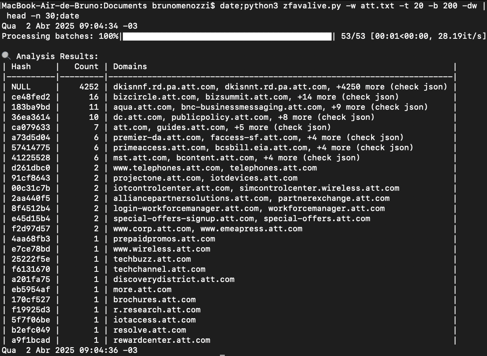

# Favicon Analyzer 🔍


A passive reconnaissance tool that leverages Yandex's favicon service to efficiently analyze historical favicons for domain research. Uses batch requests and image processing to identify valuable targets while maintaining stealth.

## Demo


https://github.com/user-attachments/assets/923cbe8f-9cd2-403d-9b34-5e83ed05adb9


## Overview

This tool helps security researchers and threat intelligence analysts quickly:
- Identify high-value targets by grouping domains with identical favicons
- Filter out domains that **PROBABLY** never existed (based on Yandex's historical data)
- Perform passive reconnaissance without directly contacting target domains

**Why Yandex?** 

While several services provide favicon fetching, Yandex uniquely offers a batch endpoint (`favicon.yandex.net`) that:
- Allows requesting multiple favicons in a single HTTP call
- Maintains historical favicon data even for inactive domains
- Doesn't trigger alerts on target systems (requests never hit the actual domains)

## Key Features

- **Batch Processing** - Request up to 200 domains in single call (URL length optimized)
- **Smart Caching** - TTL-based cache to avoid reprocessing seen domains
- **Stealth Analysis** - No direct contact with target infrastructure
- **Advanced Filtering** - Automatic detection of "blank" favicons (NULL results)
- **Multi-Format Output** - Table, JSON, and CSV output support
- **Concurrent Processing** - Async I/O for high-performance network operations

## Installation

```bash
# Clone repository
git clone https://github.com/yourusername/favicon-analyzer.git
cd favicon-analyzer

# Install dependencies
pip install -r requirements.txt
```

## Requirements:

- Python 3.8+
- libjpeg/zlib (for Pillow image processing)
Tested on Ubuntu/Debian, macOS (Homebrew)

### Script visualization
- 4977 domains in 2 seconds:


### Usage

```bash
./favicon_analyzer.py -w domains.txt [-b BATCH_SIZE] [-t THREADS] [-o FORMAT]
Command Line Options:

text
  -u URL, --url URL      Single analysis URL
  -w WORDLIST, --wordlist WORDLIST
                        Domain list file
  -b BATCH, --batch BATCH
                        Batch size (default: 20)
  -t THREADS, --threads THREADS
                        Concurrency threads (default: 10)
  -o {table,json,csv}, --output-format {table,json,csv}
                        Output format (default: table)
  -dw, --show-white-hashes
                        Include null/white icons in output
```

#### Analyze 50 domains per batch with 15 concurrent threads
```bash
./favicon_analyzer.py -w targets.txt -b 50 -t 15

| Hash     | Count | Domains                                      |
|----------|-------|----------------------------------------------|
| a1b2c3d4 | 12    | bank.com, secure-pay.net, +10 more...        |
| NULL     | 8     | expired-domain.net, placeholder-site.org... |
| e5f6g7h8 | 3     | dev-environment.com, test-server.local      |
```


#### Single domain analysis
```bash
./favicon_analyzer.py -u https://example.com
```

### Key Insights

- High Count Hashes: Domains sharing identical favicons (potential related infrastructure)
- NULL Entries: Domains without historical favicon data (may be unused/misspelled)
- Unique Hashes: Likely legitimate/active domains worth deeper investigation

### Technical Details

- Batch domain requests to Yandex endpoint
- Split composite image into individual favicons
- Generate SHA-256 hashes (first 8 chars shown)
- Detect blank/white favicons (marked as NULL)

### Optimizations

▶️ Intelligent Batching: Automatic URL length optimization

♻️ TTL Caching: 24-hour cache to prevent duplicate processing

🛡️ Validation: Strict domain format checking before processing

🎭 Concurrency: Async I/O with configurable worker pool

### Accuracy Notes
- NULL Results may indicate:
  - Domain never existed
  - Site uses default/no favicon
  - Yandex has no historical record
- ~8-22% false positives possible for active domains without distinctive favicons
- Always verify high-value targets with additional reconnaissance methods
